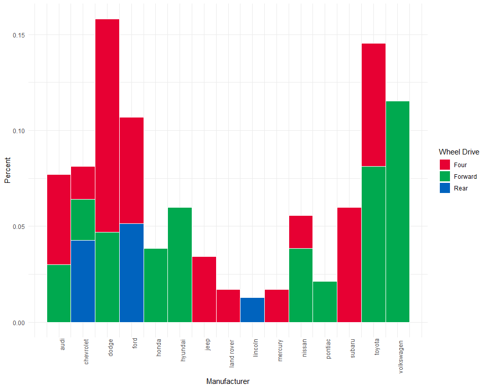
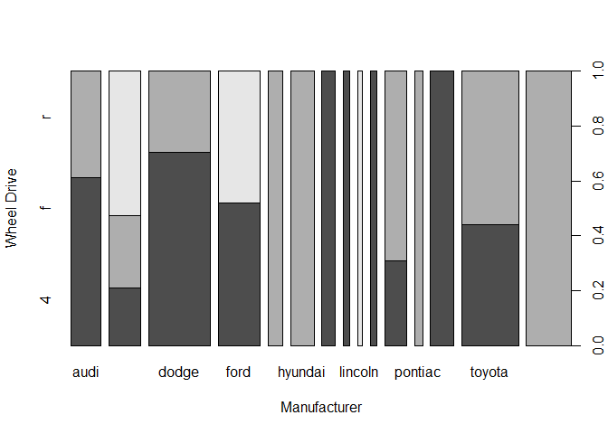

```r
d <- mpg %>%
    count(manufacturer, drv) %>%
    mutate(total = sum(n), 
           fraction = n / total)

lab <- d %>%
    dplyr::distinct(manufacturer, .keep_all = T) %>%
    select(manufacturer, total) %>%
    ungroup() %>%
    mutate(position = 1.5 * (cumsum(total) + cumsum(lag(total, default = 0))))

d %>%
  inner_join(lab) %>%
  ggplot(aes(position, fraction, fill = drv, width = 3*total)) +
  geom_bar(stat = "identity", color = "white") +
  scale_x_continuous(labels = lab$manufacturer, breaks = lab$position) +
  scale_fill_manual(name = "Wheel Drive", 
                    labels = c("4" = "Four",
                               "f" = "Forward",
                               "r" = "Rear"),
                    values = c("4" = "#E70033",
                               "f" = "#00A94F",
                               "r" = "#0063BE")) + 
  theme_minimal() +
  theme(axis.text.x = element_text(angle = 90, hjust = 1.1)) +
  labs(x = "Manufacturer", y = "Percent")
```

```
## Joining, by = c("manufacturer", "total")
```




```r
spineplot(factor(mpg$drv)~factor(mpg$manufacturer), 
          xlab = "Manufacturer", ylab = "Wheel Drive")
```



