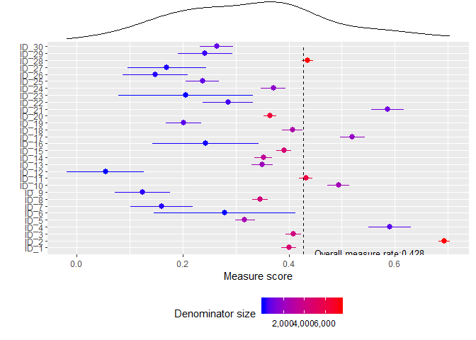

```r
library(tidyverse)
library(pacman)
p_load("ggExtra")
p_load("gridExtra")

dat <- read_csv("./data/scatter_plot_demo.csv")
```

```
## Parsed with column specification:
## cols(
##   num = col_integer(),
##   denom = col_integer(),
##   score = col_double(),
##   overall_score = col_double(),
##   id = col_character(),
##   LB = col_double(),
##   UB = col_double(),
##   Performance = col_character()
## )
```

```r
dat$id <- factor(dat$id, levels = dat$id)

plot_density <- ggplot(dat) +
  geom_density(aes(score)) +
  theme(legend.position = "none",          
       axis.title.x = element_blank(),
       axis.title.y = element_blank(),
       axis.text.x = element_blank(),
       axis.text.y = element_blank(), 
       plot.margin = unit(c(3,-5.5,4,3), "mm"))

plot_main <- ggplot(dat, 
                    aes(x = id, 
                        y = score)) +
  geom_pointrange(aes(ymin = LB, ymax = UB,
                      color = denom)) + 
  scale_color_gradient(low = "blue", high = "red",
                       name = "Denominator size",
                       labels = scales::comma) +
  geom_segment(aes(x = 0, y = dat$overall_score[1], 
                   xend = dim(dat)[1], 
                   yend = dat$overall_score[1]), 
               linetype = 2, color = "black")  + 
  labs(x = "", y = "Measure score") +
  annotate(geom = "text",
           x = 2, y = dat$overall_score[1] %>% round(3),
           label = paste0("Overall measure rate:",
                          dat$overall_score[1] %>% round(3)),
           hjust = -0.1, vjust = 2, color = "black", size = 3.5) +
  coord_flip() + theme(legend.position = "bottom")
#+
#  theme_classic()

grid.arrange(plot_density, plot_main, 
             ncol=1, nrow=2, heights=c(1, 4))
```


```r
# quick way to draw density plot
ggMarginal(plot_main, type = "density", margins = "x")
```



```r
# https://stackoverflow.com/questions/8545035/scatterplot-with-marginal-histograms-in-ggplot2

# https://stackoverflow.com/questions/17370853/align-ggplot2-plots-vertically/17371177#17371177
```


